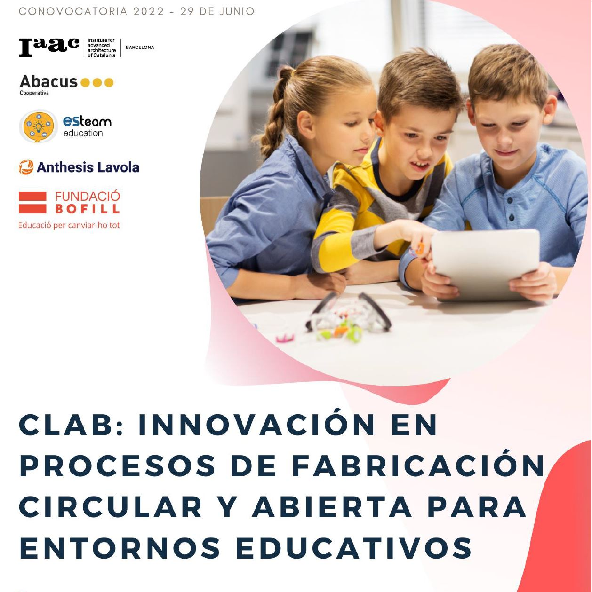
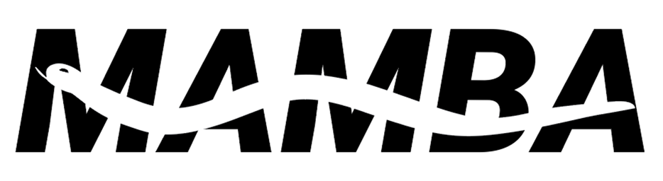

# AEI-CLAB MAMBA Grasshopper Slicer

[ACCESO A DESCARGA DE MAMBA EN FOOD4RHINO](https://www.food4rhino.com/en/app/mamba).

Repositorio para el proyecto AEI-CLAB. Entregable de FabLab Barcelona conteniendo el script parámetrico de impresión 3d para Grasshopper-Rhinoceros [MAMBA](https://www.food4rhino.com/en/app/mamba)

## Resumen de AEI-CLAB

El objetivo de este proyecto es promover el uso de la tecnología maker y la impresión 3D en el ámbito educativo, utilizando materiales sostenibles y biocompatibles como la pasta de biomateriales.
La impresión 3D es una técnica de fabricación aditiva que permite la creación de objetos tridimensionales a partir de un modelo digital. Esta tecnología está revolucionando diversos campos, desde la industria hasta la medicina y la educación.

El uso de la impresión 3D en la educación permite a los estudiantes desarrollar habilidades técnicas y creativas, así como comprender conceptos científicos y tecnológicos de manera práctica y amena. Además, la utilización de biomateriales en la impresión 3D contribuye a la sostenibilidad y al desarrollo de soluciones innovadoras y responsables con el medio ambiente.
Este proyecto incluye talleres y actividades prácticas dirigidos a estudiantes de nivel secundario y universitario, en los que se enseñan los fundamentos de la impresión 3D y se explorarán las posibilidades de la pasta de biomateriales como material de impresión. Los participantes tendrán la oportunidad de diseñar y fabricar sus propios objetos utilizando esta tecnología, fomentando así su creatividad e innovación.
Esperamos que este proyecto contribuya a la formación de una nueva generación de jóvenes comprometidos con la sostenibilidad y la tecnología, y que promueva el uso de la impresión 3D como herramienta educativa y de innovación.

## Un poco historia sobre MAMBA

Este complemento está diseñado para usarse en casi cualquier tipo de impresora 3D genérica, tanto FDM (modelado por deposición fundida) como impresoras de pasta (biomateriales cerámicos con control de presión o motor), hasta fabricantes robóticos a gran escala que usan tecnologías FFF y se ejecutan desde Gcode. o para un generador de ruta simple en ellos.
Disponible para usarse para preparar de forma inmediata con valores de defectos para la impresora 3D de cerámica para la impresora de cerámica interna construida en un 'Plug and Play' para geometrías de jarrones, o de una manera más controlada y experimental con entrada personalizada.

Esto debería funcionar con la mayoría de los principales firmware (Marlin, Repetier, RepRap, etc.) y Gcode Reader. Si encuentra algún problema relacionado con Gcode, háganoslo saber.

Este complemento ha sido probado durante más de 3 años en IAAC-FabLab Barcelona por cientos de estudiantes y personal que ayudan a mejorarlo y hacerlo tan fácil de usar como sea posible. Al proporcionar un complemento completo pero fácil de usar, este complemento puede ser utilizado tanto por personas no expertas (por ejemplo, arquitectos y diseñadores familiarizados con la caja de herramientas paramétrica de Grasshopper) como por usuarios avanzados (que pueden experimentar con los diferentes utilidades y ensamblador GCode para ingresar directamente líneas tridimensionales espaciales para generar rutas de impresión y variar el rango de parámetros de entrada para personalizar su diseño de impresión)

## Contenido repositorio

Este repositorio contiene:

- Plugin de instalación/archivos instalables .ghuser objects [link](MambaV7.9.zip)
- Manual de uso de MAMBA en inglés [link](MambaManual_eng.pdf)
- Manual de uso de MAMBA en castellano  [link](MambaManual_esp.pdf)
- Archivo de grasshopper de ejemplo [file template comentado](ExampleFile7.9.zip)

## Instalación

     En Grasshopper, seleccione Archivo > Carpetas especiales > Carpeta de componentes. Guarde el archivo gha allí.
     Haga clic derecho en el archivo> Propiedades> asegúrese de que no haya texto "bloqueado"
     Reinicie Rhino y Grasshopper

## Créditos

Esta página web slicer fue creada por Eduardo Chamorro Martin para FabLab Barcelona en el IAAC (Instituto de Arquitectura Avanzada de Cataluña), en el contexto del programa de ayudas para el apoyo a agrupaciones empresariales innovadoras del Ministerio de Industria, Comercio y Turismo. Convocatoria 2022.

Bajo el proyecto **CLAB: INNOVACIÓN EN PROCESOS DE FABRICACIÓN CIRCULAR Y ABIERTA PARA ENTORNOS EDUCATIVOS**

Partners del proyecto:

- IAAC & FabLab Barcelona
- Fundación Bofill  
- Kid's Cluster
- Abacus cooperativa
- Esteam education
- Anthesis Lavola

## Agradecimientos

Este plugin fue creado por Eduardo Chamorro en FabLab Barcelona e IAAC (Instituto de Arquitectura Avanzada de Cataluña) después de 3 años de desarrollo interno y hecho público gracias al soporte y fondos del proyecto AEI-CLAB.
Agradecimientos a:
- Ashkan Foroughi Dehnavi por su arduo trabajo en el generador de código g de la ruta de impresión, creando muchas utilidades y mejorando profundamente el núcleo interno de esta herramienta.
- Josep Marti por ayudar a probar aproximadamente todas las versiones del mismo.
- Alex Dubor por su referencia de guión inicial sobre análisis y análisis de código G.
- Kunaljit Chadha por sus scripts de maquetas para análisis de impresión 3D.
- Daphne Gerodimou por todo el gran trabajo en la documentación de este complemento y las imágenes.
- Santi Fuentemilla & Guillem Camprodon por apoyar este desarrollo.
- Park Hyun por optimizar los scripts de análisis de código G.

## Contribuciones

Alentamos a que bifurque el proyecto y haga una solicitud con sus contribuciones al proyecto y desarollo de código y hardware libre.

## Licencia

Este trabajo tiene una licencia Creative Commons Attribution-NonCommercial-ShareAlike
4.0 Licencia Internacional.
Esta licencia permite que otros remezclen, modifiquen y desarrollen su trabajo sin fines comerciales.
Atribución-NoComercial-CompartirIgual
Eres libre de:
Compartir — copiar y redistribuir el material en cualquier medio o formato
Adaptar: remezclar, transformar y construir sobre el material.
El licenciante no puede revocar estas libertades mientras siga los términos de la licencia.
